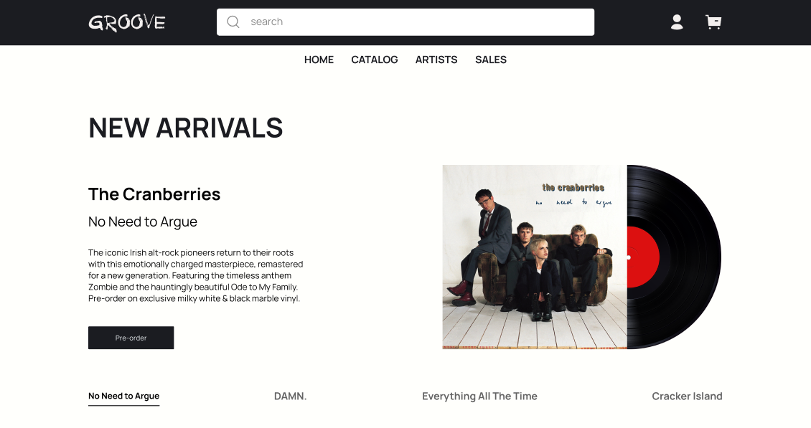

# GROOVE — Vinyl Record Store

> A full-stack vinyl record store inspired by Rough Trade. Built as a portfolio project to explore Vue 3 after working with React.


## 🔗 Live Demo

**[groove-vinyl.vercel.app](https://groove-vinyl.vercel.app)**

API hosted on Render: [groove-wfnm.onrender.com](https://groove-wfnm.onrender.com/api/albums)

> ⚠️ Free Render tier spins down after inactivity — the first request may take ~30s to wake the server.

## 📸 Preview



## 💡 About the Project

GROOVE is a fully functional vinyl record store with 80+ albums across multiple genres. Users can browse the catalog with real-time filtering, preview tracks through Spotify embeds, manage a cart, and complete checkout — all with smooth animations and scroll-preserving navigation.

I built this to deepen my Vue 3 knowledge (Composition API, Pinia, Vue Router) after coming from a React background, and to practice full-stack fundamentals — building a proper REST API, handling pagination, and deploying both frontend and backend.

## ✨ Features

- **Catalog** with server-side filtering by genre, artist, decade, price, and sale status
- **Album pages** with Spotify embed player, tracklist, technical details, and vinyl disc visualization
- **Artist pages** with bio, banner, and discography
- **Shopping cart** with localStorage persistence, quantity controls, and smooth item animations
- **3-step checkout** with form validation (Contact → Delivery → Payment)
- **Live search** dropdown across artists, albums, and genres with debouncing
- **Recently viewed** albums tracked across sessions
- **Mobile-first** responsive layout with hamburger menu

## 🛠 Tech Stack

**Frontend**
- Vue 3 (Composition API)
- TypeScript
- Tailwind CSS 4
- Pinia (state management)
- Vue Router (with KeepAlive for scroll preservation)

**Backend**
- Express 5
- TypeScript
- Server-side filtering, sorting, and pagination

**Deployment**
- Vercel (frontend)
- Render (backend)

## 🎯 Technical Highlights

These are the problems that took the most thought to solve:

- **Scroll preservation on navigation** — implemented KeepAlive caching for list views combined with `router.back()` in smart breadcrumbs, so returning from an album page restores the exact catalog scroll position the user left from.

- **Server-driven catalog** — filters, sorts, and pagination live on the backend. Frontend sends query params and displays results, following the principle that "the frontend should be dumb."

- **Smart breadcrumbs** — breadcrumb labels dynamically reflect the actual previous page (catalog → album → artist), using `window.history.state` to detect the referrer and `router.back()` / `router.go(-n)` to keep scroll state intact.

- **Reusable components** — extracted `AlbumCarousel`, `AlbumCard`, `CatalogFilters`, `AlbumTracklist`, and `AlbumDetails` to keep view files thin and composable.

- **API error handling** — every API call is wrapped in try-catch with fallback values, so a failing backend never crashes the UI.

## 📁 Project Structure
src/
├── api/              # API layer with typed responses and error handling
├── components/
│   ├── album/        # Album page sections
│   ├── catalog/      # Catalog filters
│   ├── home/         # Home page sections (NewArrivals, carousels, etc.)
│   ├── layout/       # Header, Footer, CartSidebar
│   └── shared/       # AlbumCard, AlbumCarousel, SectionHeader
├── composables/      # useDragScroll for swipe gestures
├── stores/           # Cart, RecentlyViewed (Pinia)
├── views/            # Route-level pages
└── router/           # Vue Router config
server/
├── index.ts          # Express API
└── data/             # Albums, Artists, Featured (JSON)

## 🚀 Run Locally

```bash
# Clone the repo
git clone https://github.com/ayanbaryshev02-dev/Groove.git
cd Groove

# Install dependencies
npm install

# Run backend (port 3001)
npm run server

# In another terminal, run frontend (port 5173)
npm run dev
```

Open [http://localhost:5173](http://localhost:5173) in your browser.

## 📚 What I Learned

- **Vue 3 Composition API** feels more natural for complex state logic than Options API — especially coming from React hooks.
- **KeepAlive is powerful but tricky** — it conflicts with scroll behavior by default, and combining it with `router.back()` navigation was the cleanest solution.
- **Separation of concerns matters** — after a code review, I moved all filtering logic from the frontend to the backend. The frontend should "ask and display," not compute.
- **Mobile responsiveness is easier with `md:` prefixes** than with separate mobile components — one source of truth for each UI piece.
- **Deploy early, deploy often** — catching production-only bugs (CORS, env variables, TypeScript strict mode) late in the process is painful.

## 👤 Author

**Ayan Baryshev**

- GitHub: [@ayanbaryshev02-dev](https://github.com/ayanbaryshev02-dev)
- LinkedIn: [ayan-baryshev](https://www.linkedin.com/in/ayan-baryshev-4a38a2366/)
- Telegram: [@Ayanbaryshev](https://t.me/Ayanbaryshev)
- Email: ayanbaryshev02@gmail.com